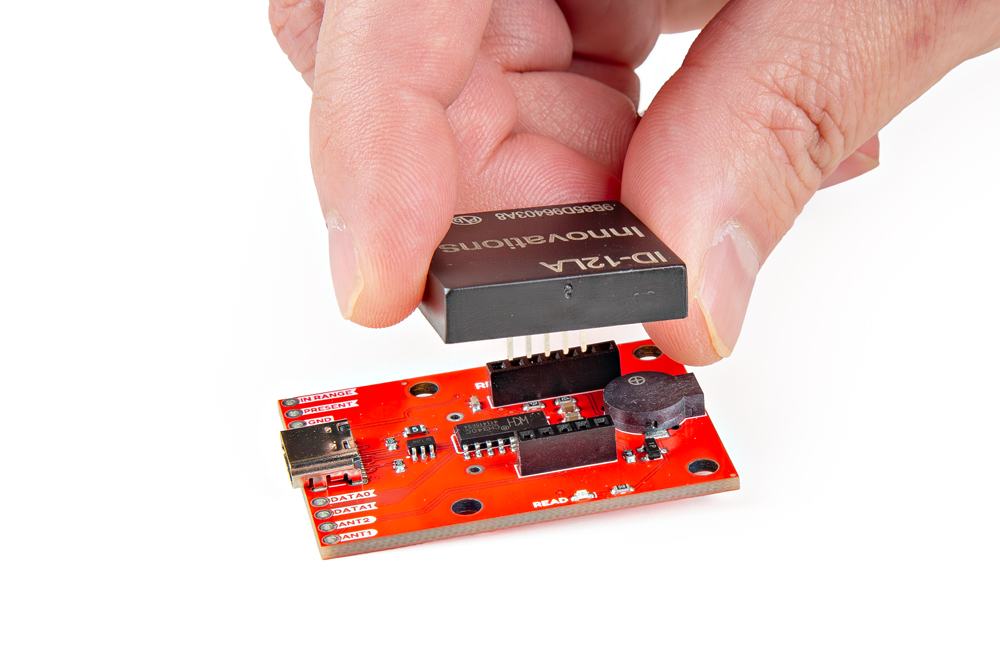
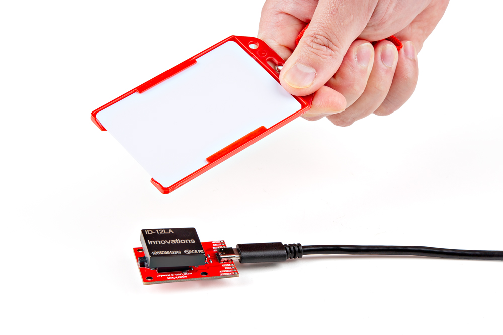

## RFID Module
User will need to attach a compatible [ID-Innovations Tiny, non-write, RFID module](https://www.id-innovations.com/Modules(non%20write).htm) *(excluding the Mifare readers, marked with an **MF**)* to the USB-C RFID Reader.

<figure markdown>
[{ width="750" }](./assets/img/hookup_guide/assembly-rfid_module.jpg "Click to enlarge")
<figcaption markdown>Attaching an [ID-12LA module](https://www.sparkfun.com/rfid-reader-id-12la-125-khz.html) to the USB-C RFID Reader.</figcaption>
</figure>

!!! warning
	While most of the [ID-innovations read-only Tiny modules](https://www.id-innovations.com/Modules(non%20write).htm), will have an internal antenna; any of the ID-3XX modules will likely require an external antenna to function. Users should consult with the module's datasheet, when purchasing.

## USB-C Cable
Once an RFID module has been attached, connect the USB-C RFID Reader to your computer with a USB cable to read a compatible RFID tag.

<figure markdown>
[{ width="750" }](./assets/img/hookup_guide/assembly-scan.jpg "Click to enlarge")
<figcaption markdown>Connect the USB-C RFID Reader to a computer, in order to read an RFID tag.</figcaption>
</figure>
