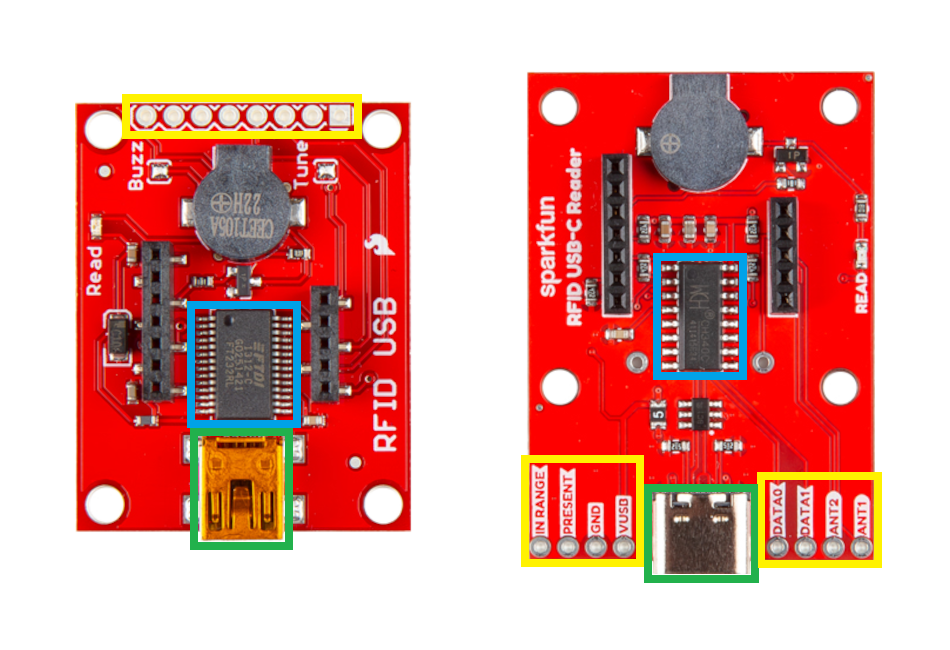
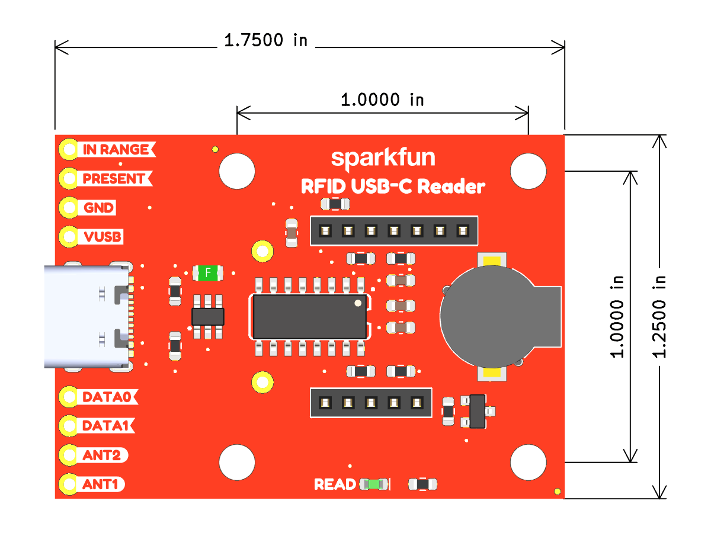
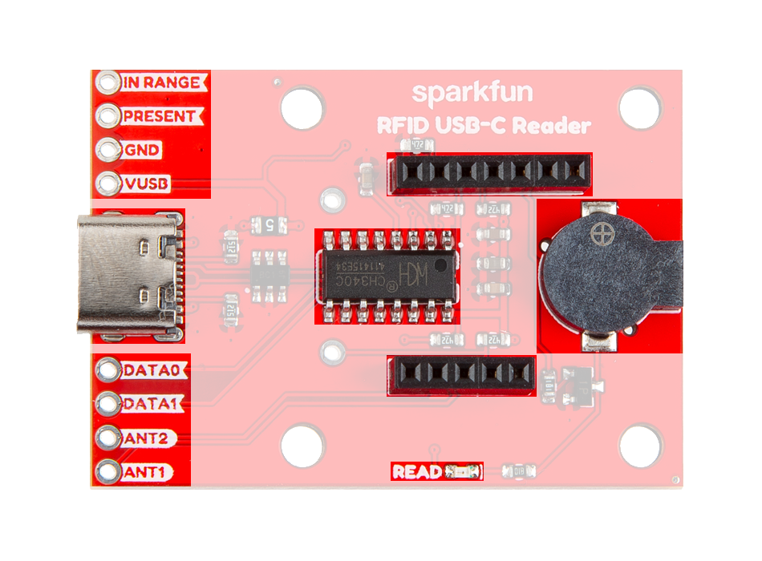
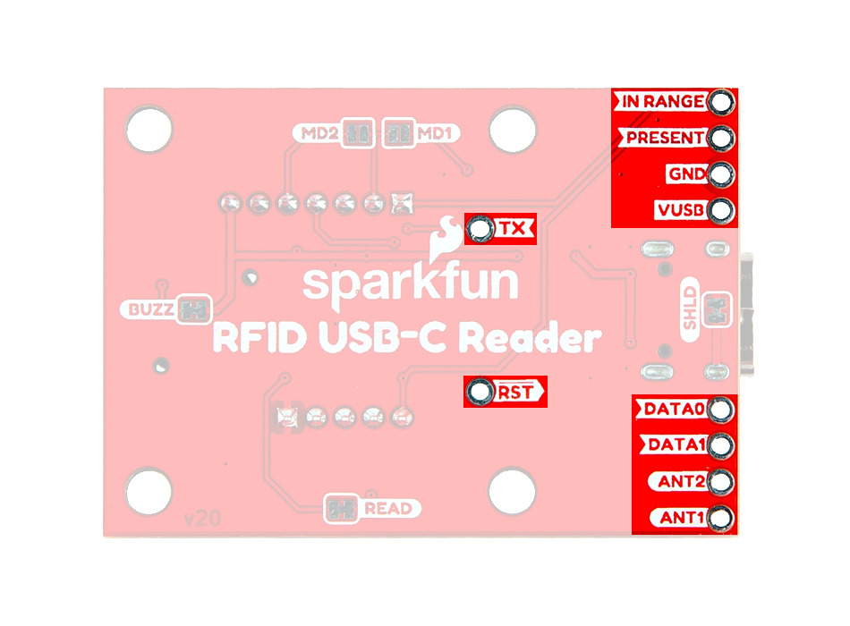
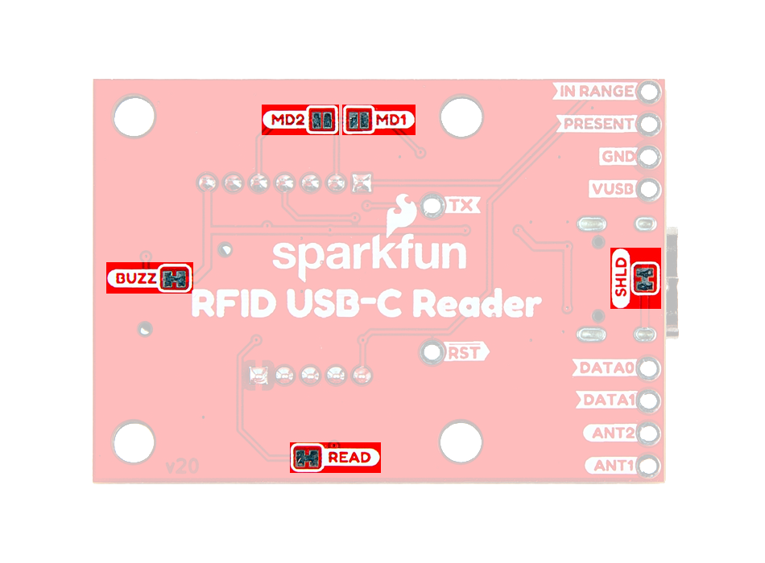

## :material-folder-cog: Design Files

<!-- Import the component -->

-   :kicad-primary:{ .enlarge-logo } Design Files

	---

	- :fontawesome-solid-file-pdf: [Schematic](./assets/board_files/schematic.pdf)
	- :material-folder-zip: [KiCad Files](./assets/board_files/kicad_files.zip)
	- :material-rotate-3d: [STEP File](./assets/3d_model/cad_model.step)
	- :fontawesome-solid-file-pdf: [Board Dimensions](./assets/board_files/dimensions.pdf):
		- 1.75" x 1.25" (44.45mm x 31.75mm)

-   <!-- Boxes in tabs -->

	=== "Updates"

		

		[{ width="450" }](./assets/img/hookup_guide/comparison.png "Click to enlarge")
		<figcaption markdown>Major changes between the original USB RFID Reader *(left)* and new USB-C RFID Reader *(right)*.</figcaption>
		

		- **USB Connector**
		:	We have updated the USB mini-B connector to the more prevalent USB-C connector.
		- **USB-to-Serial Converter**
		:	We have transitioned to a most cost-effective the USB-to-serial converter, the [CH340C from WCH](https://www.wch-ic.com/products/CH340.html?).
		- **PTH Breakout Pins**
		:	The PTH pins have been relocated and now feature silkscreen labels.

	=== "3D Model"
		

		<model-viewer src="../assets/3d_model/web_model.glb" camera-controls poster="../assets/3d_model/poster.png" tone-mapping="neutral" shadow-intensity="1.8" environment-image="legacy" exposure="0.75" shadow-softness="0.4" camera-orbit="0deg 75deg 0.09285m" field-of-view="21.02deg" style="width: 100%; height: 450px;">
		</model-viewer>

		[Download the `*.step` File](./assets/3d_model/cad_model.step "Click download"){ .md-button .md-button--primary width="250px" }

		

		???+ tip "Manipulate 3D Model"
			

			| Controls       | Mouse                    | Touchscreen    |
			| :------------- | :----------------------: | :------------: |
			| Zoom           | Scroll Wheel             | 2-Finger Pinch |
			| Rotate         | ++"Left-Click"++ & Drag  | 1-Finger Drag  |
			| Move/Translate | ++"Right-Click"++ & Drag | 2-Finger Drag  |

			

	=== "Dimensions"
		

		[{ width="450" }](./assets/board_files/dimensions.png "Click to enlarge")
		<figcaption markdown>
		Dimensions of the USB-C RFID Reader.
		</figcaption>
		

		???+ tip "Need more measurements?"
			For more information about the board's dimensions, users can download the [KiCad files](./assets/board_files/kicad_files.zip) for this board. These files can be opened in KiCad and additional measurements can be made with the measuring tool.

			!!! info ":octicons-download-16:{ .heart } KiCad - Free Download!"
				KiCad is free, open-source [CAD]("computer-aided design") program for electronics. Click on the button below to download their software. *(\*Users can find out more information about KiCad from their [website](https://www.kicad.org/).)*

				

				[Download :kicad-primary:{ .enlarge-logo }](https://www.kicad.org/download/ "Go to downloads page"){ .md-button .md-button--primary width="250px" }
				

	
			???+ info ":straight_ruler: Measuring Tool"
				This video demonstrates how to utilize the dimensions tool in KiCad, to include additional measurements:

				

				<article class="video-500px">
				<iframe src="https://www.youtube.com/embed/-eXuD8pkCYw" title="KiCad Dimension Tool" frameborder="0" allow="accelerometer; autoplay; clipboard-write; encrypted-media; gyroscope; picture-in-picture" allowfullscreen></iframe>
				</article>
				{ .qr }
				

<!-- 
## Design Updates
We have made a few changes with our newest version of the USB-C RFID Reader. The most significant of these changes are detailed below:

<figure markdown>
[{ width="750" }](./assets/img/hookup_guide/comparison.png "Click to enlarge")
<figcaption markdown>Major changes between the original USB RFID Reader *(left)* and new USB-C RFID Reader *(right)*.</figcaption>
</figure>

1. **USB Connector**
:	We have updated the USB mini-B connector to the more prevalent USB-C connector.
1. **USB-to-Serial Converter**
:	We have transitioned to a most cost-effective the USB-to-serial converter, the [CH340C from WCH](https://www.wch-ic.com/products/CH340.html?).
1. **PTH Breakout Pins**
:	The PTH pins have been relocated and now feature silkscreen labels.

 -->

## Board Layout
The USB-C RFID Reader has the following features:

<figure markdown>
[{ width="750" }](./assets/img/hookup_guide/layout.png "Click to enlarge")
<figcaption markdown>Layout of the major components on the USB-C RFID Reader.</figcaption>
</figure>

1. **USB-C Connector**
:	The primary interface for the USB-C RFID Reader. It provides power to the RFID module and reads any serial data output, through a CH340C converter.
1. **PTH Breakout Pins**
:	Two sets of 0.1" pitch PTH pins that breakout the primary connections to the RFID module.
1. **Female Headers**
:	Two sets of 2mm pitch, female headers that are compatible with the [ID-Innovations Tiny, non-write, RFID modules](https://www.id-innovations.com/Modules(non%20write).htm) *(excluding the Mifare readers, marked with an **MF**)*.
1. **Buzzer**
:	An audio indicator for card reads.
1. **`READ` LED**
:	A green status indication LED for card reads.
1. **CH340C USB-to-Serial Converter**
:	The CH340C converts the serial output from the RFID module for the USB interface.

## Breakout Pins
The primary function of the USB-C RFID Reader is to flip the pin connections between its headers, on the top and bottom of the board.

<figure markdown>
[{ width="750" }](./assets/img/hookup_guide/io-pins.png "Click to enlarge")
<figcaption markdown>Pin connections between the top and bottom of the USB-C RFID Reader.</figcaption>
</figure>

- `IN_RANGE`
:	This pin is toggled when an RFID tag is *in range*.
- `PRESENT`
:	This output is only used when the [output data format is set to Magnetic Emulation](#jumpers).
- `GND`
:	The common ground or the 0V reference for the voltage supplies.
- `VUSB`
:	The voltage from the USB-C connector, usually **5V**.
- `TX`
:	Connected to the `TX` pin of the CH340C
- `RST`
:	Connected to the `RES` (reset) pin of the RFID module. By default, this is pin is pulled high by the `VUSB` pin.
- `LED`
:	This pin is activated when a tag is read and triggers the `READ` LED and buzzer on the board.
- `DATA0`/`DATA1`
:	The behavior of these pins vary, depending on the [output data format that is chosen](#jumpers).
- `ANT2`/`ANT1`
:	These pins are utilized for an external antennal. This is likely to be necessary for any of the ID-3XX modules. Users should consult with their module's datasheet.

## Jumpers
There are five jumpers on the back of the board that can be used to easily modify the hardware connections on the board.

<figure markdown>
[{ width="750" }](./assets/img/hookup_guide/jumpers.png "Click to enlarge")
<figcaption markdown>The jumpers on the top of the USB-C RFID Reader.</figcaption>
</figure>

???+ note "Never modified a jumper before?"
	Check out our <a href="https://learn.sparkfun.com/tutorials/664">Jumper Pads and PCB Traces tutorial</a> for a quick introduction!

	<article class="grid cards" markdown align="center">

	-   <a href="https://learn.sparkfun.com/tutorials/664">
		<figure markdown>
		
		</figure>

		---

		**How to Work with Jumper Pads and PCB Traces**</a>

	</article>

`SHLD`
:	This jumper can be cut to disconnect the shielding of the USB-C connector from the `GND` plane of the board

`BUZZ`
:	This jumper can be cut to remove power from the buzzer.

`READ`
:	This jumper can be cut to remove power from the green `READ` LED.

`MD1`/`MD2`
:	These jumpers can be modified to control the format of the RFID module's data output between [`ASCII`](https://en.wikipedia.org/wiki/ASCII), [`Magnet Emulation`](https://en.wikipedia.org/wiki/Digital_card#Magnetic_stripe_card), or [`Wiegand26`](https://en.wikipedia.org/wiki/Wiegand_interface). By default, the jumpers are set for the `ASCII` data format.

	

	| Data Format      | `MD1`  | `MD2`  |
	| :--------------- | :----: | :----: |
	| ASCII            | Open   | Open   |
	| Magnet Emulation | Open   | Closed |
	| Wiegand26        | Closed | Open   |

	

	!!! info
		The CH340C can only interpret data in the `ASCII` format. An external microcontroller or device should be utilized when another data format is chosen.

