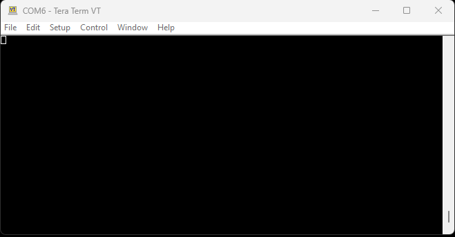

<!-- Call outs from Into -->
--8<-- "./introduction.md::8"

<!-- Design Changes -->
--8<-- "./hardware_overview.md:93:118"

<!-- USB Driver -->
--8<-- "./software_overview.md::27"

<!-- Attach RFID Module -->
--8<-- "./hardware_assembly.md::7"

## Scan a Tag
In a terminal emulator, users will need to connect to the `COM` port of the USB-C RFID Reader and configure the port's settings to **9600bps** `8`-`N`-`1`. Once configured properly, users can scan compatible RFID tags and their unique ID will be displayed in the terminal emulator.

<figure markdown>
[{ width="500" }](./assets/img/hookup_guide/assembly-scan.jpg "Click to enlarge")
<figcaption markdown>Scan an RFID tag with the USB-C RFID Reader.</figcaption>
</figure>

<figure markdown>
[{ width="700" }](./assets/img/hookup_guide/demo-read_tags.gif "Click to enlarge")
<figcaption markdown>The unique ID of RFID tags being displayed in the terminal emulator.</figcaption>
</figure>

