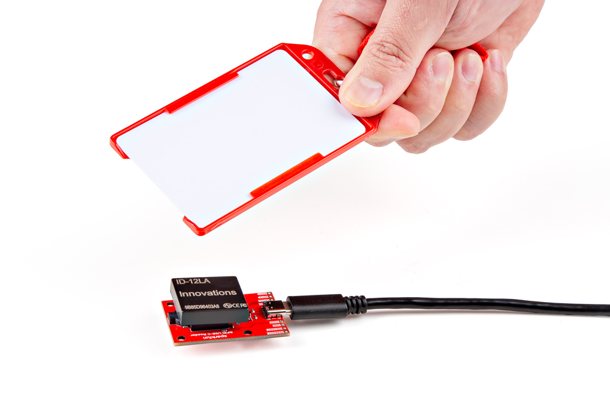

## USB Driver
Users will need to install a USB driver for the CH340C serial-to-USB chip, in order to communicate with the RFID module. The latest USB drivers for the CH340C are available from the manufacturer, on the [WCH website](https://www.wch-ic.com/products/CH340.html?):

-   :material-microsoft-windows: **Windows**

	---

	[:octicons-download-16:{ .heart } Download `CH341SER.EXE`](https://www.wch-ic.com/downloads/CH341SER_EXE.html){ .md-button .md-button--primary target="blank" }

-   :material-apple: **MacOS**

	---

	[:octicons-download-16:{ .heart } Download `CH341SER_MAC.ZIP`](https://www.wch-ic.com/downloads/CH34XSER_MAC_ZIP.html){ .md-button .md-button--primary target="blank" }

-   :material-linux: **Linux**

	---

	[:octicons-download-16:{ .heart } Download `CH341SER_LINUX.ZIP`](https://www.wch-ic.com/downloads/CH341SER_LINUX_ZIP.html){ .md-button .md-button--primary target="blank" }

???+ abstract "Need Directions?"
	For users having trouble installing the CH340 USB driver, check out our video and hookup guide:

	

	

	

	<iframe src="https://www.youtube.com/embed/MM9Fj6bwHLk" title="Tutorial: Installing CH340 Drivers" frameborder="0" allow="accelerometer; autoplay; clipboard-write; encrypted-media; gyroscope; picture-in-picture" allowfullscreen></iframe>
	

	

	

	-   <a href="https://learn.sparkfun.com/tutorials/908">
		<figure markdown>
		
		</figure>

		---

		**How to Install CH340 Drivers**</a>

	

	

## Terminal Emulator
In order to read the `ASCII` data output from an RFID module, for when a RFID tag is read, users will need to install a [serial terminal emulator](https://learn.sparkfun.com/tutorials/terminal-basics) on their computer.

-   
:material-microsoft-windows: **Windows**

	---

	For Windows computers, we highly recommend [TeraTerm](https://teratermproject.github.io/index-en.html).

-   
:material-linux: **Linux**

	---

	Some Linux operating systems may already have the `screen` terminal emulator preinstalled.

!!! abstract "Need Directions?"
	Check out our hookup guide to install your favorite terminal emulator:

	

	-   <a href="https://learn.sparkfun.com/tutorials/112">
		<figure markdown>
		
		</figure>

		---

		**Serial Terminal Basics**</a>

	

### Read an RFID Tag
To display the ASCII data output properly, users will need to connect to the `COM` port of the USB-C RFID Reader and configure the port settings to **9600bps** `8`-`N`-`1`. Once configured properly, users can scan compatible RFID tags and their unique ID will be displayed in the terminal emulator.

<figure markdown>
[{ width="500" }](./assets/img/hookup_guide/assembly-scan.jpg "Click to enlarge")
<figcaption markdown>Scan an RFID tag with the USB-C RFID Reader.</figcaption>
</figure>

<figure markdown>
[{ width="700" }](./assets/img/hookup_guide/demo-read_tags.gif "Click to enlarge")
<figcaption markdown>The unique ID of RFID tags being displayed in the terminal emulator.</figcaption>
</figure>

